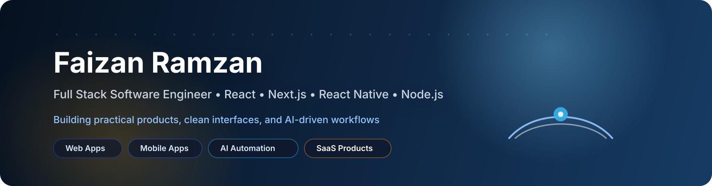

## About

I build web and mobile products with a focus on practical business value, clean architecture, and fast delivery.

## At a Glance

<table>
  <tr>
    <td valign="top" width="33%">
      <strong>Focus</strong> 
      Web apps 
      Mobile apps 
      Backend systems 
      AI workflows
    </td>
    <td valign="top" width="33%">
      <strong>Stack</strong> 
      React 
      Next.js 
      React Native 
      Node.js
    </td>
    <td valign="top" width="33%">
      <strong>Currently building</strong> 
      SaaS products 
      Admin dashboards 
      Automation tools 
      AI-assisted workflows
    </td>
  </tr>
</table>

## GitHub Snapshot

- Public original repositories: 27
- Profile repo: `I-faizan-ramzan`
- Main focus areas: web apps, mobile apps, backend systems, and practice projects
- Location: Pakistan

## Core Strengths

<table>
  <tr>
    <td valign="top" width="25%"><strong>Web</strong> React Next.js Tailwind CSS</td>
    <td valign="top" width="25%"><strong>Mobile</strong> React Native Expo Navigation</td>
    <td valign="top" width="25%"><strong>Backend</strong> Node.js Express MongoDB</td>
    <td valign="top" width="25%"><strong>AI / Cloud</strong> Automation Workers Agent workflows</td>
  </tr>
</table>

## Featured Projects

| Project | Focus | Stack |
| --- | --- | --- |
| [tradex-mobile](https://github.com/I-faizan-ramzan/tradex-mobile) | Mobile stock trading app | Expo, React Native, Tailwind CSS |
| [Expense-Tracker-React-Native](https://github.com/I-faizan-ramzan/Expense-Tracker-React-Native) | Expense management | React Native, Context API |
| [Meal-App-React-Native](https://github.com/I-faizan-ramzan/Meal-App-React-Native) | Meal browsing and planning | React Native, Redux Toolkit |
| [node-backend-projects](https://github.com/I-faizan-ramzan/node-backend-projects) | Backend practice and APIs | Node.js, server-side patterns |
| [MERN-Practice-Project](https://github.com/I-faizan-ramzan/MERN-Practice-Project) | Note-taking app | MERN stack |
| [Weather-App](https://github.com/I-faizan-ramzan/Weather-App) | Weather dashboard | React |

## All Public Projects

### Frontend and Landing Pages

| Repository | Summary |
| --- | --- |
| [Amazone-Clone](https://github.com/I-faizan-ramzan/Amazone-Clone) | Amazon-style landing page built with HTML and CSS. |
| [Daraz-Clone](https://github.com/I-faizan-ramzan/Daraz-Clone) | Landing page built with HTML and Tailwind CSS. |
| [Landing-Page](https://github.com/I-faizan-ramzan/Landing-Page) | Landing page built with HTML and Tailwind CSS. |
| [ProPakistani-Clone](https://github.com/I-faizan-ramzan/ProPakistani-Clone) | ProPakistani landing page clone built with HTML and CSS. |
| [medely](https://github.com/I-faizan-ramzan/medely) | HTML, CSS, and Bootstrap 5 project. |
| [medely-clone](https://github.com/I-faizan-ramzan/medely-clone) | Medely clone built with HTML, CSS, and Bootstrap 5. |
| [CalculateMe](https://github.com/I-faizan-ramzan/CalculateMe) | Simple calculator project. |
| [Weather-App](https://github.com/I-faizan-ramzan/Weather-App) | React weather app. |
| [spotify-clone](https://github.com/I-faizan-ramzan/spotify-clone) | Spotify-style clone. |
| [understandingEvents](https://github.com/I-faizan-ramzan/understandingEvents) | React events practice project. |

### Visual Notes

The top of this README uses local SVG artwork so the profile stays polished without relying on broken remote card services.

### Mobile Apps

| Repository | Summary |
| --- | --- |
| [Expense-Tracker-React-Native](https://github.com/I-faizan-ramzan/Expense-Tracker-React-Native) | React Native expense tracker with navigation and Context API. |
| [Meal-App-React-Native](https://github.com/I-faizan-ramzan/Meal-App-React-Native) | React Native meal app with drawer navigation and Redux Toolkit. |
| [react-native-places-app](https://github.com/I-faizan-ramzan/react-native-places-app) | Places app with camera access and maps. |
| [React-Native-Guess-Game-App](https://github.com/I-faizan-ramzan/React-Native-Guess-Game-App) | React Native guess game app. |
| [tradex-mobile](https://github.com/I-faizan-ramzan/tradex-mobile) | Mobile stock trading app built with Expo, React Native, and Tailwind CSS. |
| [user-authentication-a-React-Native-App](https://github.com/I-faizan-ramzan/user-authentication-a-React-Native-App) | React Native authentication app. |

### Backend and MERN

| Repository | Summary |
| --- | --- |
| [MERN-Practice-Project](https://github.com/I-faizan-ramzan/MERN-Practice-Project) | MERN practice note-taking app. |
| [node-backend-projects](https://github.com/I-faizan-ramzan/node-backend-projects) | Node.js and server-side project collection. |
| [impact_analyzer](https://github.com/I-faizan-ramzan/impact_analyzer) | Project repository for impact analysis work. |
| [NextSkills](https://github.com/I-faizan-ramzan/NextSkills) | Practice repository for Next.js and related work. |

### Practice, Quizzes, and Profile

| Repository | Summary |
| --- | --- |
| [Counter-App](https://github.com/I-faizan-ramzan/Counter-App) | Component state update practice app. |
| [Counter-App1](https://github.com/I-faizan-ramzan/Counter-App1) | Simple counter app. |
| [Quiz-2-Faizan-Ramzan-](https://github.com/I-faizan-ramzan/Quiz-2-Faizan-Ramzan-) | Quiz practice repository. |
| [Quiz-3](https://github.com/I-faizan-ramzan/Quiz-3) | Quiz practice repository. |
| [Quiz3makeup](https://github.com/I-faizan-ramzan/Quiz3makeup) | Quiz practice repository. |
| [FaizanGMTRNO](https://github.com/I-faizan-ramzan/FaizanGMTRNO) | Personal practice or utility repository. |
| [I-faizan-ramzan](https://github.com/I-faizan-ramzan/I-faizan-ramzan) | Profile README and portfolio repository. |

## What I Am Learning

- Agentic AI
- Large language models
- RAG systems
- AI workflow automation
- System design
- Cloudflare edge runtime

## Connect

- GitHub: [I-faizan-ramzan](https://github.com/I-faizan-ramzan)
- LinkedIn: [Faizan Ramzan](https://www.linkedin.com/in/faizan-ramzan-91bb93175)

