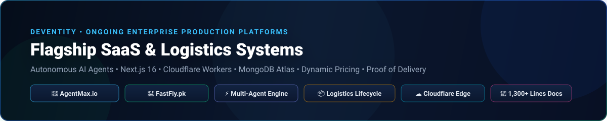
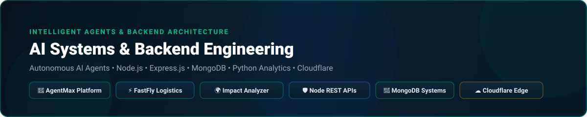
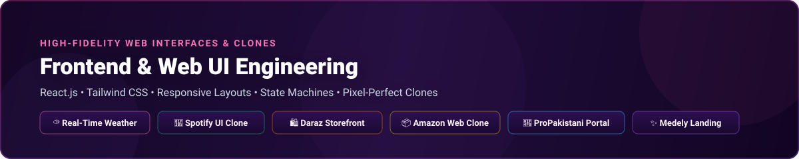

<div align="center">


<p align="center">
  <a href="https://github.com/I-faizan-ramzan"></a>
  <a href="https://www.linkedin.com/in/faizan-ramzan-91bb93175"></a>
  
</p>

</div>

---

## 👨‍💻 About Me

I am a **Full Stack & Mobile Software Engineer** currently engineering enterprise platforms at **Deventity**. I specialize in building **high-throughput SaaS platforms, autonomous AI agent ecosystems, cross-platform mobile apps, and mission-critical logistics infrastructures**.

My work bridges modern cloud and edge architectures — deploying scalable systems on **Next.js & Cloudflare Workers**, engineering real-time backends with **Node.js, Express & Socket.io**, developing cross-platform mobile experiences with **React Native & Expo**, and crafting intelligent **AI automation workflows**.

```ts
const faizan = {
  role: "Full Stack & Mobile Software Engineer",
  company: "Deventity 🏢",
  location: "Pakistan 🇵🇰",
  flagshipProjects: ["AgentMax.io (AI Platform)", "FastFly.pk (Logistics & Fintech)"],
  mobileStack: ["React Native", "Expo", "Redux Toolkit", "Context API", "Native APIs"],
  webStack: ["Next.js 16", "React 19", "TypeScript", "Node.js", "Express.js", "MongoDB", "Tailwind CSS"],
  aiAndCloud: ["AI Agents", "LLM Integration", "Cloudflare Workers", "OpenNext", "Socket.io", "System Design"],
  currentFocus: ["Enterprise AI SaaS", "High-Throughput Logistics Platforms", "React Native Mobile Apps"],
  goal: "Architect robust, intuitive, high-impact digital products that scale effortlessly",
};
```

---

## 🚀 Ongoing Flagship Enterprise Projects (Deventity)

<p align="center">
  
</p>

### 🤖 1. [AgentMax](https://agentmax.io/) — Enterprise Multi-Agent AI Automation Platform

<p align="left">
  <a href="https://agentmax.io/"></a>
  
  
  
</p>

**AgentMax** is an enterprise-grade multi-agent AI automation and conversational commerce SaaS platform engineered at **Deventity**, designed to deploy, orchestrate, and manage autonomous AI agents across modern business touchpoints 24/7.

* 🌐 **Live Application:** [https://agentmax.io/](https://agentmax.io/)
* 🛠️ **Core Technologies:** `Next.js 16` `React 19` `TypeScript` `Cloudflare Workers Edge` `OpenNext.js` `Node.js` `Express.js` `Socket.io` `Payload CMS 3` `PostgreSQL` `MongoDB Atlas` `n8n` `OpenAI GPT-4o` `Stripe` `Tailwind CSS` `shadcn/ui`

#### 🌟 Key Platform Capabilities & Modules:
* **🤖 10+ Specialized Autonomous AI Agents:**
  * **Venn (Customer Support):** Synthetic employee with persistent persona memory, FAQ lookup, sentiment tracking, and automated human escalation.
  * **Flint (Sales & Lead Qualification):** Inbound objection handling, product discovery, and revenue lift calculation.
  * **Pulse (WhatsApp E-Commerce):** Real-time conversational ordering, interactive cart construction, and address collection.
  * **Orbit (AI CMO & SEO Engine):** Autonomous technical audits, keyword discovery, Generative Engine Optimization (GEO), and automated GitHub PR creation.
  * **OrderConfirmation™ & Voice Agents:** Twilio IVR voice calls with 3x retry logic and real-time speech agents.
  * **MailPilot & WhatsApp Campaigns:** Automated bulk marketing broadcasts with AI auto-replies.
* **💬 Full-Cycle WhatsApp Conversational Commerce:**
  * Direct catalog sync from Shopify, WooCommerce, Google Sheets, or manual databases.
  * Conversational cart management, delivery address collection, human escalation with automated sweeper daemons, and OTP verification for staff.
* **🔍 AI CMO, SEO & Generative Engine Optimization (GEO):**
  * Automated technical crawls assessing Core Web Vitals (Google PageSpeed API), robots.txt, schema markup, and backlinks.
  * GEO probe tracking brand citations across ChatGPT, Gemini, and Perplexity.
  * Direct GitHub repository integration: inspects code, proposes patches, and automatically opens GitHub Pull Requests with exact diffs.
* **📢 Omnichannel Social & CMS Distribution:**
  * Draft-first proposal publishing workflow across X (Twitter), LinkedIn, Meta (Facebook/Instagram), Bluesky, Mastodon, WordPress, Sanity, and GitHub.
* **🛡️ Enterprise Multi-Tenancy & Edge Security:**
  * AES-256-GCM encrypted credential storage, SHA-256 stateless session tokens verified on Cloudflare Edge runtime via native Web Crypto, and Stripe tiered licensing.

---

### 🚚 2. [FastFly](http://fastfly.pk/) — Enterprise Courier, Logistics & COD Financial Management Platform

<p align="left">
  <a href="http://fastfly.pk/"></a>
  
  
  
</p>

**FastFly** is a high-throughput, full-scale courier, freight, and Cash-on-Delivery (COD) logistics management platform engineered at **Deventity**, bridging e-commerce merchants, regional branch distribution hubs, field couriers, and corporate finance.

* 🌐 **Live Platform:** [http://fastfly.pk/](http://fastfly.pk/)
* 🛠️ **Core Technologies:** `Next.js 16 (App Router)` `React 19` `TypeScript` `Cloudflare Workers Edge` `Material UI v9 (@mui/x-data-grid)` `Tailwind CSS 4` `MongoDB Atlas` `Mongoose 9` `NextAuth.js` `JWT RBAC` `Cloudinary CDN` `EmailJS` `JsBarcode` `jsPDF`

#### 🌟 Key Platform Capabilities & Modules:
* **🏢 5 Dedicated Portals & Role-Based Workflows:**
  * **Public Onboarding:** Multi-step merchant KYC registration & rider recruitment portals with document uploads.
  * **Merchant / Customer Portal:** Single and bulk CSV booking, barcode loadsheet generation, thermal waybill printing, real-time tracking, Shipper Advice dispute desk for delivery failures, and settlement invoices.
  * **Branch Operations Hub:** Merchant drop-off intake, physical scale weight verification, sorting queue, inter-branch container manifesting, incoming arrival verification, rider route assignment, and daily COD cash reconciliation.
  * **Field Rider Mobile Workflows:** Scan-to-accept route parcels, out-for-delivery updates, photo & digital signature Proof-of-Delivery (POD) uploads to Cloudinary, COD cash collection, and failure reason logging.
  * **Admin Master Console:** Global platform analytics, KYC application approvals, service area & dynamic rate card builder, branch permission toggles, and automated settlement payout approvals.
* **📈 Dynamic Pricing Engine & Geographical Zone Matrix:**
  * Multi-tiered zone matrix: **Zone A** (Same City), **Zone B** (Same Division), **Zone C** (Same Province), and **Zone D** (Inter-Province).
  * Automated computation of base slab rates, additional per-kg weight charges, fuel surcharges, COD handling fees, remote area modifiers, and withholding taxes (GST, WHT).
  * Frozen immutable pricing snapshots stored on booking to ensure complete financial integrity.
* **💰 Automated Settlement, Billing & Cash Integrity:**
  * Multi-cycle automated merchant billing (`instant`, `weekly`, `15_days`, `monthly`).
  * End-of-day branch cash closings and rider cash remittance tracking to prevent revenue leakage.
* **⚡ Edge Deployment & High Resiliency:**
  * Deployed on Cloudflare Workers edge runtime via OpenNext, custom MongoDB DNS resolver patch for serverless connection pooling, and atomic session invalidation (`accessVersion`).

---

## 📱 Mobile Applications (React Native & Expo)

<p align="center">
  
</p>

| Mobile App | Focus & Architecture | Key Technologies |
| :--- | :--- | :--- |
| [**📈 tradex-mobile**](https://github.com/I-faizan-ramzan/tradex-mobile) | Modern stock trading mobile application with market watchlist, real-time tracking, asset details, and clean financial UI. | `React Native` `Expo` `Tailwind CSS` `Nativewind` |
| [**💳 Expense-Tracker-React-Native**](https://github.com/I-faizan-ramzan/Expense-Tracker-React-Native) | Full-featured personal finance and expense management app with nested Stack & Bottom Tab Navigation and global state management. | `React Native` `Stack Nav` `Bottom Tabs` `Context API` |
| [**🍲 Meal-App-React-Native**](https://github.com/I-faizan-ramzan/Meal-App-React-Native) | Recipe and meal discovery app with categories, dietary filters, favorite bookmarking, and multi-level Drawer & Stack navigation. | `React Native` `Drawer Nav` `Redux Toolkit` `Context API` |
| [**📍 react-native-places-app**](https://github.com/I-faizan-ramzan/react-native-places-app) | Location-aware native mobile app utilizing hardware camera access and interactive maps to capture, store, and display places. | `React Native` `Camera API` `Maps Integration` `Location` |
| [**🔐 user-authentication-a-React-Native-App**](https://github.com/I-faizan-ramzan/user-authentication-a-React-Native-App) | Secure authentication flow with input validation, persistent authentication state, and protected route navigation. | `React Native` `AsyncStorage` `Auth Flow` `Security` |
| [**🎮 React-Native-Guess-Game-App**](https://github.com/I-faizan-ramzan/React-Native-Guess-Game-App) | Interactive number guessing game with custom components, game feedback loop, dynamic layouts, and smooth animations. | `React Native` `Custom UI` `Responsive Design` `Game Logic` |

---

## 🤖 Featured AI, SaaS & Web Projects

<p align="center">
  
</p>

| Project | Organization / Type | Description | Live Platform | Key Technologies |
| :--- | :--- | :--- | :--- | :--- |
| **AgentMax** | **Deventity** *(Flagship)* | Multi-agent AI platform: 10+ autonomous agents, WhatsApp e-commerce, AI CMO / SEO engine, and social distribution. | [🌐 agentmax.io](https://agentmax.io/) | `Next.js 16` `Socket.io` `Cloudflare` `OpenAI` `MongoDB` |
| **FastFly** | **Deventity** *(Flagship)* | Logistics & COD platform: 5 portals, dynamic zone pricing matrix, rider POD, and automated merchant settlements. | [🌐 fastfly.pk](http://fastfly.pk/) | `Next.js 16` `MERN` `Cloudflare` `MUI v9` `MongoDB` |
| [**Ai-Environmental-Impact-Analyzer**](https://github.com/I-faizan-ramzan/Ai-Environmental-Impact-Analyzer) | Open Source | AI-driven environmental impact assessment tool providing actionable sustainability insights and metrics. | [GitHub Repository](https://github.com/I-faizan-ramzan/Ai-Environmental-Impact-Analyzer) | `Python` `AI / ML` `Data Analysis` |
| [**node-backend-projects**](https://github.com/I-faizan-ramzan/node-backend-projects) | Open Source | Modular server-side architectures, REST API microservices, middleware pipelines, and scalable database designs. | [GitHub Repository](https://github.com/I-faizan-ramzan/node-backend-projects) | `Node.js` `Express.js` `MongoDB` `REST APIs` |

---

## 🛠️ Tech Stack & Tools

<div align="center">


</div>

<br/>

| Category | Technologies & Tools |
| :--- | :--- |
| **Mobile Development** | React Native, Expo, Nativewind, React Navigation, AsyncStorage, Redux Toolkit, Context API |
| **Frontend Web** | React.js, Next.js, TypeScript, JavaScript (ES6+), HTML5, CSS3, Tailwind CSS, Redux |
| **Backend & Databases** | Node.js, Express.js, RESTful APIs, MongoDB, Mongoose, Cloudflare Workers |
| **DevOps & Tools** | Git, GitHub, Docker, Postman, Figma, VS Code |

---

## 📊 GitHub Analytics

<div align="center">


<br/><br/>


</div>

---

## 🏆 GitHub Achievements & Trophies

<div align="center">

<a href="https://github.com/I-faizan-ramzan?tab=achievements">
  
</a>
<a href="https://github.com/I-faizan-ramzan?tab=achievements">
  
</a>
<a href="https://github.com/I-faizan-ramzan?tab=achievements">
  
</a>

<br/>

<a href="https://github.com/I-faizan-ramzan?tab=achievements">
  
</a>

<br/><br/>


</div>

---

## 📈 Activity & Contribution Graph

<div align="center">


</div>

---

## 📂 Complete Repository Directory

<details open>
<summary><strong>🚀 Flagship Enterprise Platforms (Deventity)</strong></summary>
<br/>

| Platform | Live Link | Focus & Key Capabilities | Core Tech Stack |
| :--- | :--- | :--- | :--- |
| **AgentMax** | [🌐 agentmax.io](https://agentmax.io/) | Multi-agent AI platform: 10+ autonomous agents, WhatsApp conversational commerce, AI CMO / SEO engine, real-time streaming chat, and social distribution. | `Next.js 16` `Socket.io` `Cloudflare Workers` `OpenAI` `MongoDB Atlas` `Stripe` |
| **FastFly** | [🌐 fastfly.pk](http://fastfly.pk/) | Logistics & COD platform: 5 portals, dynamic zone pricing matrix, rider route dispatch with photo/signature POD, and automated merchant settlements. | `Next.js 16` `MERN` `Cloudflare Workers` `MUI v9` `MongoDB Atlas` `Cloudinary` |

</details>

<details open>
<summary><strong>📱 Mobile Applications</strong></summary>
<br/>

| Repository | Description | Key Tech |
| :--- | :--- | :--- |
| [**tradex-mobile**](https://github.com/I-faizan-ramzan/tradex-mobile) | Mobile stock trading app built with Expo, React Native, and Tailwind CSS | React Native, Expo, Tailwind |
| [**Expense-Tracker-React-Native**](https://github.com/I-faizan-ramzan/Expense-Tracker-React-Native) | Mobile expense tracker with Stack & Tab navigation and Context API | React Native, Context API |
| [**Meal-App-React-Native**](https://github.com/I-faizan-ramzan/Meal-App-React-Native) | Meal app with Drawer navigation, Redux Toolkit, and recipe filtering | React Native, Redux Toolkit |
| [**react-native-places-app**](https://github.com/I-faizan-ramzan/react-native-places-app) | Native app combining device camera access and maps to save user places | React Native, Camera, Maps |
| [**user-authentication-a-React-Native-App**](https://github.com/I-faizan-ramzan/user-authentication-a-React-Native-App) | Mobile user onboarding, registration, and secure authentication flow | React Native, Auth |
| [**React-Native-Guess-Game-App**](https://github.com/I-faizan-ramzan/React-Native-Guess-Game-App) | Interactive number guessing game with responsive layouts and feedback | React Native, Game Logic |

</details>

<details>
<summary><strong>🤖 AI & Backend Engineering</strong></summary>
<br/>

| Repository | Description | Key Tech |
| :--- | :--- | :--- |
| [**Ai-Environmental-Impact-Analyzer**](https://github.com/I-faizan-ramzan/Ai-Environmental-Impact-Analyzer) | AI-driven environmental impact analysis and sustainability insights | Python, AI/ML |
| [**impact_analyzer**](https://github.com/I-faizan-ramzan/impact_analyzer) | Core analytics algorithms and environmental dataset processing | Python, Analytics |
| [**node-backend-projects**](https://github.com/I-faizan-ramzan/node-backend-projects) | Server-side architectures, REST APIs, authentication, and system design | Node.js, Express, MongoDB |
| [**MERN-Practice-Project**](https://github.com/I-faizan-ramzan/MERN-Practice-Project) | Full-stack MERN note-taking application with CRUD operations | MongoDB, Express, React, Node |
| [**NextSkills**](https://github.com/I-faizan-ramzan/NextSkills) | Next.js full-stack capabilities, server actions, and modern web patterns | Next.js, React, TypeScript |

</details>

<details>
<summary><strong>🎨 Frontend Web & UI Clones</strong></summary>
<br/>

<p align="center">
  
</p>

| Repository | Description | Key Tech |
| :--- | :--- | :--- |
| [**Weather-App**](https://github.com/I-faizan-ramzan/Weather-App) | Real-time interactive weather forecasting web application | React.js, OpenWeather API |
| [**spotify-clone**](https://github.com/I-faizan-ramzan/spotify-clone) | Modern Spotify music player and web application interface clone | React.js, CSS3 |
| [**Daraz-Clone**](https://github.com/I-faizan-ramzan/Daraz-Clone) | E-commerce storefront landing page clone | HTML5, Tailwind CSS |
| [**Amazone-Clone**](https://github.com/I-faizan-ramzan/Amazone-Clone) | Amazon landing page and navigation clone | HTML5, CSS3 |
| [**ProPakistani-Clone**](https://github.com/I-faizan-ramzan/ProPakistani-Clone) | Responsive digital news publication landing page | HTML5, CSS3 |
| [**medely-clone**](https://github.com/I-faizan-ramzan/medely-clone) | Healthcare platform landing page clone | HTML5, CSS3, Bootstrap 5 |
| [**medely**](https://github.com/I-faizan-ramzan/medely) | Medely responsive web layout implementation | HTML5, CSS3, Bootstrap 5 |
| [**Landing-Page**](https://github.com/I-faizan-ramzan/Landing-Page) | Modern responsive SaaS landing page | HTML5, Tailwind CSS |
| [**CalculateMe**](https://github.com/I-faizan-ramzan/CalculateMe) | Clean JavaScript calculator application | JavaScript, CSS3 |
| [**Counter-App**](https://github.com/I-faizan-ramzan/Counter-App) | React component state management counter | React.js |
| [**Counter-App1**](https://github.com/I-faizan-ramzan/Counter-App1) | Interactive counter application with state updates | React.js |
| [**understandingEvents**](https://github.com/I-faizan-ramzan/understandingEvents) | React event handling and synthetic events playground | React.js |

</details>

---

<div align="center">

### ⭐ Building scalable web, mobile & AI solutions with clean code.


</div>
